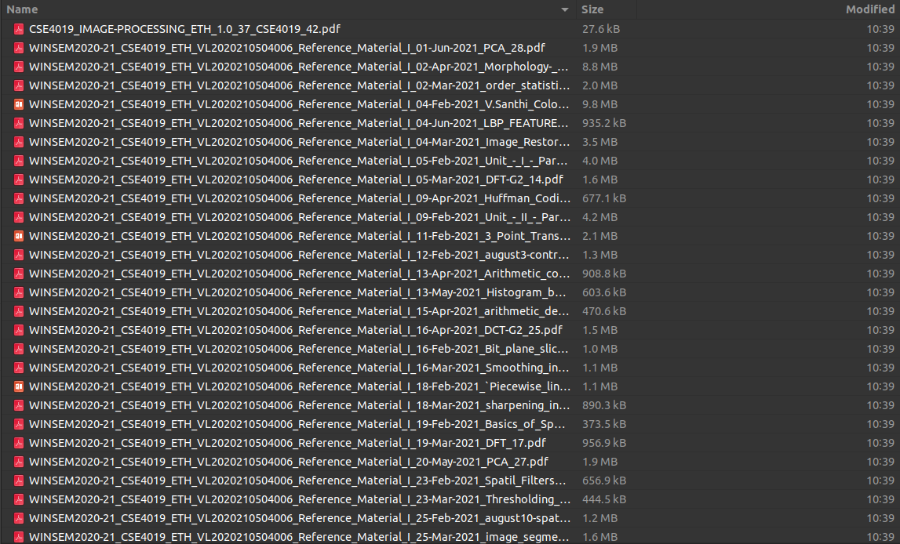
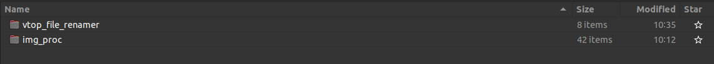
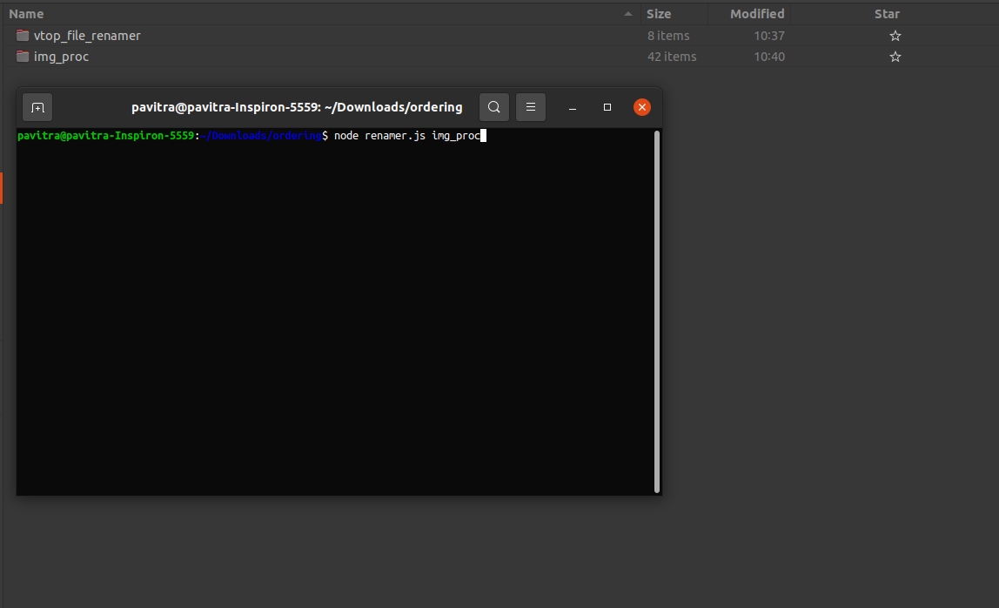
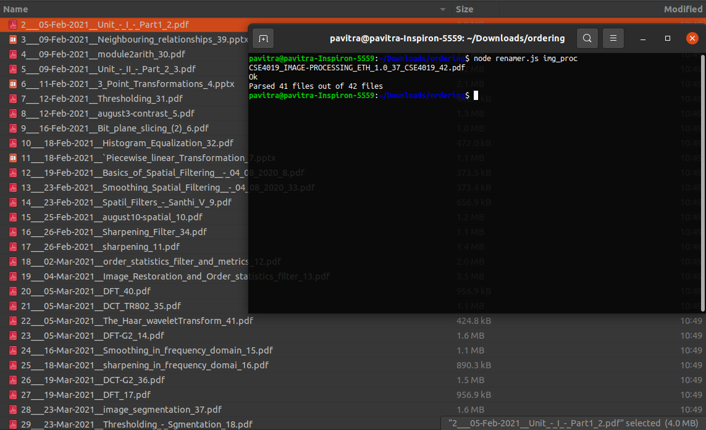

# Hi there
This is a simple renamer and kind of a file arrangement utility for files downloaded from VTOP.

# To use this utility, system requirements are:

## Node version>=12

To run this Project:

Step1: Fork this repository in the directory same as where other directories are stored for different courses.
 
Step2: Open a CLI and type node 'renamer.js {}' , where {} will contain name of the directory , {} is just a placeholder.
 
Step3: That's it.

 

Note: This utility might not pass parse all files so free free to give any suggestions to improve the regex used.

# References

This is the inital folder structure
 

    

 
 

This is the command for running the utility 
Don't worry about the CLI(Command line interface) folder structure it is a little altered 
The directory vtop.... should contain the repository code 
 

    
    

 
 

This is the final output of the utility, The CLI will show the files which were not parsed in the first line, the second line flag is just for reference, has nothing to do with the working, and the third line tells the output and effect of the code executed.
 

    

